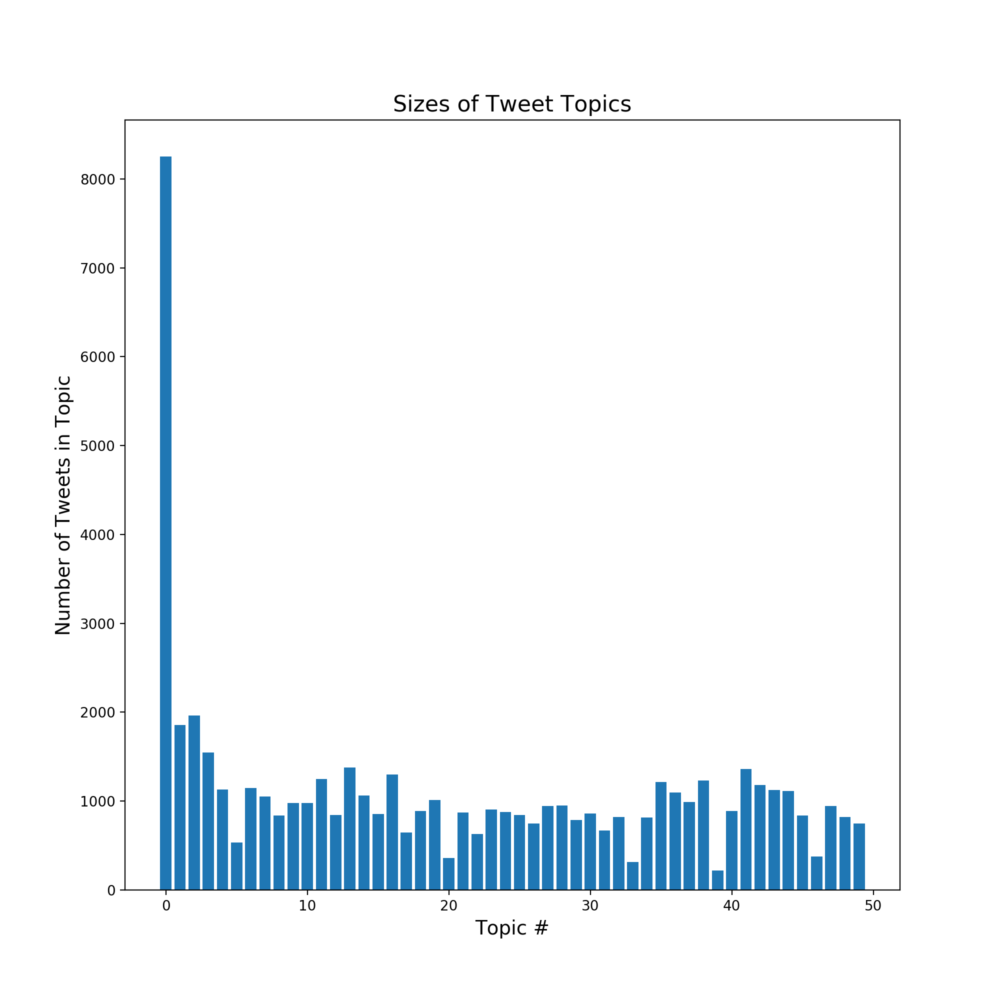
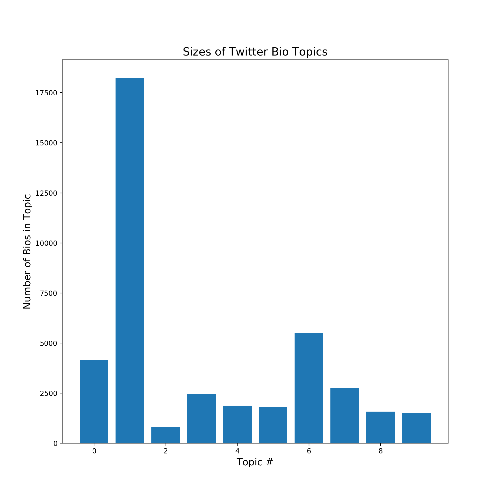

# Studying Belief Revision on Twitter

## Table of Contents

* [Introduction and Project Goals](#introduction-and-project-goals)
* [Data Collection and Storage](#data-collection-and-storage)
* [Data Analysis](#data-analysis)
  * [Overview](#overview)
  * [Nonnegative Matrix Factorization](#nonnegative-matrix-factorization)
  * [Topic Coherence and Tweet Aggregation](#topic-coherence-and-tweet-aggregation)
* [Topic Modeling Results](#topic-modeling-results)
* [Time Series](#time-series)
* [Evaluating Data Quality](#evaluating-data-quality)
* [Clustering Twitter Users](#clustering-twitter-users)
* [References](#references)


## Introduction and Project Goals

The goal of this project was to investigate cases wherein people overtly express a change of opinion on a subject via Twitter. More specifically, the aim was to attempt to answer at least the first of the following two questions:

```
(1) With respect to what issues are people most likely to express a change of opinion?
(2) What kinds of people are changing their minds?
```

All of my code can be found within the [src folder](src/) in this repository. The following sections clarify the function of each script in the src folder and provide examples
of some of the results of my analysis.


## Data Collection and Storage

To obtain the necessary data to conduct this analysis, I wrote a script called
[get_tweets.py](src/get_tweets.py) that uses Twitter's Python wrapper for their premium search API to collect tweets. This script queries for tweets containing the phrases "changed my mind," "changed my opinion," or "changed my view." To be more certain that the resulting tweets actually correspond to a change of opinion, I excluded negations of these statements (e.g., "haven't/hasn't changed my mind") and I also excluded retweets (since retweets do not necessarily represent endorsements of the original tweet). Ensuring that the tweets returned by the queries are genuine examples
of Twitter users changing their minds on a particular topic is a nontrivial issue,
which I address in detail in the next section.

Using the [get_tweets.py](src/get_tweets.py) script, I collected a total of 55,539 unique tweets (created between January 26, 2018 and March 28, 2018) that matched my search query. Each batch of tweets was saved in the form of a .pkl file.

**Note on Twitter's Python Wrapper for the premium search API**:
Each tweet returned by the API comes in the form of a Tweet Object (dictionary-like object), which contains the actual textual content of the tweet
along with a host of other field including the date when the tweet was created,
the Twitter bio of the user who authored the tweet, and any URLs provided in the tweet.
For more details on Twitter's Python wrapper for their premium API, please see items [2](#references) and [3](#references).


## Data Analysis

### Overview

My general approach to answering the first question posed in the Introduction
section was as follows:

  1\. Assemble a collection, or *corpus*, of tweets. I employed
  three methods of assembling tweet corpora:

  ```
  (1) Create a list of individual tweets
  (2) If a particular tweet quotes another tweet, combine both tweets and form a list from the resulting documents
      (I call this a quote-aggregated corpus)
  (3) Perform quote-aggregation, but also aggregate tweets sharing the same hashtag and form a list from the
      resulting documents (I call this a hashtag-aggregated corpus). For more details, see the Topic Coherence
      and Tweet Aggregation section.
 ```

  2\. *Clean*, *stem*, and *tokenize*, each tweet. Cleaning is the process of removing
  extraneous content from the text (e.g., URLs and punctuation), stemming is the
  process of shortening words to reduce the total number of words (or 'features')
  in our corpus (e.g., 'running' and 'ran' both map to 'run'), and tokenizing is
  the process of breaking the resulting text down into a list of its constituent
  words.

  3\. Transform the cleaned/stemmed/tokenized tweet corpus into a Term Frequency-Inverse Document Frequency (TF-IDF) matrix.

  4\. Perform topic modeling via Nonnegative Matrix Factorization (NMF) in order
  to determine the domains within which people are most commonly changing their minds.

  5\. Assess the *coherence* of the resultant topics in order to evaluate the
  quality of the results.


Part 1 in the above procedure is handled by the [get_tweet_corpus.py](src/get_tweet_corpus.py), which
defines a TweetCorpus class that, given a list of .pkl files containing the tweet
batches, assembles each of the three corpora and stores them as class attributes.
Parts 2-4 in the above procedure are executed by the [BuildNMF.py](src/BuildNMF.py) script,
which defines a class structure called BuildNMF. Part 5 is handled by BuildNMF.py and [evaluate_nmf.py](src/evaluate_nmf.py), where the former computes values of a metric that rates the coherence of each latent topic and the latter generates plots for visualization.


### Nonnegative Matrix Factorization

Nonnegative Matrix Factorization (NMF) is a common method for topic modeling. The method entails an approximate factorization of the TF-IDF matrix, *V*, into a product
of two matrices: *W* and *H*, as shown in the image below. Furthermore, we stipulate that all of the elements of *W* and *H* are nonnegative.


Each row in the *W* matrix corresponds to a document (tweet or aggregation of
tweets), and each column of *W* corresponds to one of the latent topics. Each row
of *H* corresponds to one of the latent topics and each column of *H* corresponds
to each of the words in the entire corpus of tweets. Hence, the magnitude of
*W<sub>ij</sub>* can be interpreted as the degree to which the ith document is associated with jth latent topic , and the magnitude of *H<sub>jk</sub>* is the degree to which the jth topic is associated with the kth word.

Under the hood, we solve for *W* and *H* using an Alternating Least Squares (ALS)
method. The product of *W* and *H* will only approximate the original matrix *V*,
so we define the *reconstruction error* as the Frobenius norm of V - WH. Below
we see that the reconstruction error decreases as we increase the number of latent topics.


### Topic Coherence and Tweet Aggregation

The main challenge of topic modeling given a corpus of tweets is that each tweet
contains relatively little content, whereas more traditional applications of topic modeling use longer documents such as news articles. Consequently there are relatively few co-occurrences of substantive words across tweets, which makes it difficult to establish coherent topics. Recent work in the field of topic modeling with Twitter data has established several methods for dealing with this issue. For example, Steinskog et al. have recommended aggregation of tweets by hashtag and by author in order to synthesize longer documents that result in increased topic coherence [[1]](#references).

Steinskog et. al also recommend a particular metric to evaluate topic coherence
known as the UMass coherence score, *C*, which is defined as


where (*w*<sub>1</sub>, ..., *w*<sub>m</sub>) are the *M* most probable words in
the topic (I used *M* = 5), *D*(*w*) is the number of documents that contain word
*w*, and *D*(*w*<sub>m</sub>, *w*<sub>l</sub>) is the number of documents that
contain both words *w*<sub>m</sub> and *w*<sub>l</sub>. The BuildNMF class has
a method that computes UMass scores for each latent topic after the NMF model has been fit. **Note: a smaller magnitude UMass score (closer to zero) represents a more coherent topic.**

As explained in the Overview section, I employed three methods for assembling
tweet corpora: (1) no aggregation, (2) quote aggregation, and (3) hashtag
aggregation. To compare these three methods, I generated the three box plots below in order to visualize the distribution of topic coherences for each corpus (created using [evaluate_nmf.py](src/evaluate_nmf.py)).


As we can see, the median UMass score is clearly closer to zero for the hashtag-aggregated corpus, which is why I chose to use the hashtag-aggregated corpus for topic modeling. Next, we need to find the *optimal* number of latent topics. We do this by comparing the box plots of UMass coherence scores for different numbers of latent topics (also generated using [evaluate_nmf.py](src/evaluate_nmf.py)).


From the above plot, we see that with 50 latent topics, three of them are particularly coherent (outliers) and the lower bound on the box plot is higher than for most other
numbers of topics. Moreover, another important consideration is the reconstruction error, which diminishes as we increase the number of topics--implying that we should lean toward picking a larger number of topics (even though the topics are generally more coherent
when the number of topics is less than 50). For all of these reasons *I chose 50 to be the ideal number of topics*.

## Topic Modeling Results

After building an NMF model with 50 latent topics, I created word clouds to display
the words that are most common within each topic (generated using [make_wordcloud.py](src/make_wordcloud.py)). As an example, the word cloud shown below clearly shows that one particular topic corresponds to US immigration issues. The size of the words is proportional to how frequently those words occur within that topic.


The bar chart below was generated using [evaluate_nmf.py](src/evaluate_nmf.py), and it shows the number of tweets belonging to that topic (the number of tweets that are more strongly associated with that particular topic than any other).



We see that the largest topic is Topic \#2. To see the words associated with Topic
\#2 or with any other topic, see the [wordclouds_50topics](wordclouds_50topics/) folder.
In that folder, each word cloud is named by its ranking and its topic index \# (e.g., the
word cloud for Topic \#2 is named [wordcloud_ranking49_topic2](wordclouds_50topics/wordcloud_ranking49_topic2.png)).


## Time Series

I also created a script called [time_series.py](src/time_series.py) to produce time series plots showing the number of tweets per day containing a particular word. Another topic
that resulted from the NMF model was a topic related to Valentine's Day, which
makes sense because our sample of tweets spans the months of January and February,
which of course includes Valentine's Day. The time series below shows the clear
spike in the frequency of the word 'valentine' right around February 14th.


## Evaluating Data Quality

In order to judge the quality of the data, I used the script [get_random_tweet_sample.py](src/get_random_tweet_sample.py) to collect a random sample of 200 tweets from my corpus, then I marked each tweet as meaningful or not (see [data_quality.md](data_quality.md)). A tweet is considered *meaningful*
if it expresses a genuine change of opinion on a particular topic. In other words,
a tweet is *not* meaningful if it is sarcastic (e.g., 'ya, i totally changed my mind 🙄😛') or it does not have enough substantive content to infer the relevant topic (e.g.,
  'changed my mind 😮').

In this analysis, the sample of tweets in data_quality.md can be viewed as a sample
from a binomial population, so we can construct a confidence interval for the proportion
of tweets that are *not* meaningful using the Agresti–Coull method (a standard and robust method for computing approximate confidence intervals for the proportion parameter
of a binomial distribution). The script [get_random_tweet_sample.py](src/get_random_tweet_sample.py) constructs this
confidence interval with the following result: **[0.25, 0.37] is a 95% confidence interval
for the proportion of tweets that are not meaningful.** This is an important caveat that
we must consider when interpreting the validity of the results of this project.  

## Clustering Twitter Users

The last step of this project was to apply the same NMF topic modeling techniques
to a corpus of Twitter bios associated with the users whose tweets were captured
in my queries. This was how I answered the second question posed in the Introduction
and Project Goals section. From this analysis I used the same method of comparing
box plots of UMass coherence scores to determine that *there were roughly 10 topics
for Twitter bios* (or, you might say, 10 types of Twitter users tweeting about changing
their opinion on a particular topic). The bar chart below shows the sizes of each
of these 10 types of Twitter users. To view the word clouds associated with each
of these topics, see the [wordclouds_10topics_bios](wordclouds_10topics_bios/) folder.




## References
* [1] [Twitter Topic Modeling By Tweet Aggregation](http://www.aclweb.org/anthology/W17-0210)
* [2] [Premium Twitter API Documentation](https://github.com/twitterdev/search-tweets-python)
* [3] [Twitter API: Building Search Rules](http://support.gnip.com/apis/search_api2.0/rules.html)
